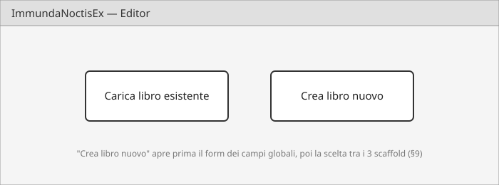
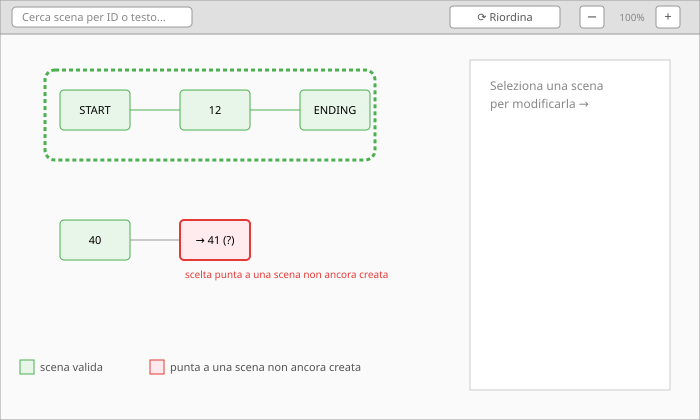
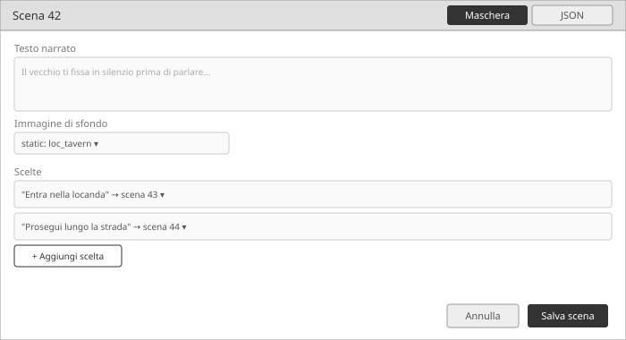
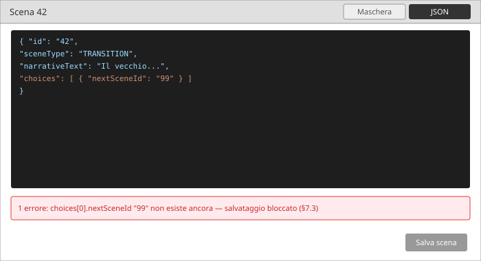

# EDITOR.md — Specifica del tool grafico di authoring (`:tool`)

Documento di specifica per la parte grafica di `:tool`: un editor visuale
che disegna la mappa delle scene di un libro e permette di crearlo o
modificarlo, girando su PC dentro Android Studio. Nasce come seconda fase
dopo l'ETL (conversione Project Aon → JSON, vedi `doc/ETL.md`): quella
parte resta CLI e non cambia; questo documento riguarda solo l'aggiunta
di un'interfaccia grafica allo stesso modulo.

Definito insieme a Michele per conversazione (29/07/2026), stesso metodo
delle altre specifiche (`doc/ARCHITETTURA.md`, `doc/REGOLE.md`,
`doc/STATO.md`, `doc/UI.md`, `doc/ETL.md`).

---

## 1. Scopo

Un libro (`Manifest` + `Scene[]`) oggi si scrive a mano in JSON o si
ottiene dall'ETL. Sopra le ~50 scene diventa scomodo tenere a mente la
struttura del grafo solo leggendo testo. Questo tool deve permettere di:

- **vedere** il grafo delle scene di un libro come una mappa navigabile;
- **modificare** un libro già esistente (uno dei 5 convertiti in
  `doc/LIBRI/`, o uno dei `content/test-books/`);
- **creare un libro nuovo da zero**, partendo da uno scaffold guidato.

È pensato per uso di Michele (rifinire libri convertiti) e di suo figlio
(scrivere libri originali senza conoscere Lupo Solitario, vedi memoria
"direzione_creativa_contenuti_adulti" e "tool_authoring_scope_ampliato") —
**deve essere utilizzabile da chi non conosce lo schema JSON a memoria**.

## 2. Tecnologia

**Compose Multiplatform Desktop**, sullo stesso modulo Kotlin/JVM
(`kotlin("jvm")` + `application`, non serve convertire `:tool` in un
modulo Kotlin Multiplatform vero e proprio): basta aggiungere al
`build.gradle.kts` esistente i plugin `org.jetbrains.compose` e
`org.jetbrains.kotlin.plugin.compose` (lo stesso compilatore Compose già
usato in `:app`) e la dipendenza `compose.desktop.currentOs`. Si lancia
con `./gradlew :tool:run` come i comandi CLI già scritti, e gira/debugga
dentro Android Studio senza uscirne — Android Studio è basato su
IntelliJ ed esegue moduli Gradle-JVM come questo indipendentemente dal
plugin "Kotlin Multiplatform" installato da Michele (utile per
l'ergonomia dell'IDE, non un requisito tecnico).

Motivazione della scelta (Michele): sviluppatore Java con background
Swing/JavaFX ma niente preferenza forte; Compose Desktop vince perché
resta nella stessa famiglia concettuale già in uso in `:app` e perché
permette di restare in Android Studio senza cambiare IDE o creare un
progetto separato.

## 3. Struttura del modulo

**Un solo modulo `:tool`**, nessun progetto/modulo nuovo. La CLI
esistente (`validate`/`convert`/`illustrazioni`, vedi `Main.kt`) e la
GUI convivono: un nuovo comando (es. `editor`) o un secondo entry point
apre la finestra Compose, riusando `core:data`/`core:engine` esattamente
come già fa la CLI (stesso `PackageRepository`/`PackageValidator`,
zero logica duplicata).

## 4. Perimetro (v1)

Dentro:
- Caricare un libro JSON esistente e visualizzarne/modificarne il grafo.
- Creare un libro nuovo da zero con scaffold guidato (§9).
- Editing completo di manifest e scene (campi, scelte, combattimento,
  discipline, immagini `static:`/`url:`).
- Validazione locale (per-scena) e globale (tutto il libro), con
  colorazione della mappa.
- Backup automatico su disco, nessuna integrazione Git (§10).

Fuori (rimandato, §13):
- Editor dei frammenti di prompt (`content/config.json`).

## 5. Flusso di avvio

All'apertura, due scelte:

1. **Carica un libro esistente** — apri un file JSON, il tool ne
   ricostruisce la mappa.
2. **Crea un libro nuovo** — prima un form per i campi globali del
   manifest (`title`, `genre`, `toneHints`, ecc. — vedi
   `doc/SCHEMA-JSON.md` §2), poi la scelta di uno dei tre scaffold
   (§9.2).

## 6. La mappa

### 6.1 Layout e navigazione

- **Auto-layout gerarchico** a partire dalla scena `START` (livelli per
  distanza nel grafo) — nessun posizionamento manuale dei nodi da fare
  a mano.
- **Pan e zoom** liberi sul canvas, con un controllo esplicito in
  barra strumenti oltre al gesto sul canvas (rotellina/pinch): due
  pulsanti `−`/`+` (scelta di partenza, più semplice da implementare di
  uno slider e coerente con "il più semplice possibile") — uno slider
  resta un'alternativa se in prova si rivela più comodo per un
  controllo fine.
- **Pulsante "Riordina automaticamente"**: ritraccia da capo
  l'auto-layout gerarchico su richiesta — utile dopo aver spostato dei
  nodi a mano o dopo aver aggiunto/rimosso scene, per tornare alla
  disposizione pulita senza dover ricaricare il libro.
- **Ricerca** per ID scena o per testo nel `narrativeText`, che centra
  la vista sul nodo trovato.
- **Evidenziazione del vicinato**: selezionando un nodo, i suoi
  collegamenti diretti (entranti e uscenti) restano ben visibili, il
  resto della mappa si attenua senza sparire.

### 6.2 Colori: salute dei nodi e dei percorsi

Due segnali visivi distinti, sempre attivi (niente proliferazione di
colori oltre questi):

- **Sfondo del nodo** (salute della singola scena): **verde** se tutti
  i suoi riferimenti in uscita (`choice.nextSceneId`,
  `disciplineChoice.nextSceneId`, `combat.winSceneId`/`loseSceneId`/
  `evadeSceneId`) puntano a scene che esistono davvero nel libro;
  **rosso** se almeno uno punta a una scena non ancora creata (vedi
  §7.3 — riferimento "in avanti", non un errore da correggere subito).
- **Contorno del percorso** (salute del cammino): tracciando un cammino
  da `START` a un finale, il contorno è **verde** solo se OGNI nodo
  lungo il cammino è verde e il cammino arriva davvero a un finale non
  di sconfitta; basta un solo nodo rosso lungo il percorso per rendere
  rosso l'intero contorno (un anello debole sporca tutta la catena).
  Il contorno di un cammino specifico si mostra **a richiesta**,
  selezionando una scena e chiedendo "mostrami un percorso da START
  fin qui" — enumerare e colorare TUTTI i cammini possibili di un
  libro da centinaia di scene non è praticabile (crescita
  combinatoria) né leggibile.
- Riuso diretto della logica già scritta in `GraphValidator`
  (`core/data`), applicata nodo per nodo invece che come report unico
  di fine libro — nessuna nuova logica di validazione dei riferimenti,
  solo un nuovo modo di presentarla.

## 7. Editing di una scena

Selezionando un nodo si apre un pannello con **due viste della stessa
scena**, alternabili con un pulsante (stesso pattern dell'editor
XML/Design di Android Studio):

### 7.1 Vista maschera

Un campo per ciascun attributo dello schema (vedi `doc/SCHEMA-JSON.md`
§4), con i casi a "catalogo chiuso" presentati come menu a tendina
invece che testo libero:
- `backgroundImage`/`npcImage`/`combat.enemyImage`: scelta tra
  `static:<id>` (con l'elenco da `doc/SUONI-IMMAGINI.md`) o `url:` con
  campo libero per il link.
- `disciplineId` di una `DisciplineChoice`: le 10 discipline canoniche.
- Scelte (`choices`): lista con `choiceText`, destinazione (vedi
  sotto), `minRoll`/`maxRoll`/`requiredItem`/`requiredFlag`.
- Blocco `combat`: nome, immagine, statistiche, tre destinazioni.

**Destinazione di una scelta**: il tool propone la lista delle scene
già esistenti nel libro per agganciare subito una reale, ma permette
anche di scrivere un ID nuovo per una scena non ancora creata (pensata
ma non ancora scritta) — vedi §7.3 per cosa succede in quel caso.

### 7.2 Vista JSON

Editor di testo della scena in formato JSON grezzo, con gli stessi
errori di validazione mostrati a fianco — via di fuga per i casi che
la maschera non copre ancora (es. un nuovo `gameMechanic`).

### 7.3 Validazione locale (blocco in uscita)

Chiudere il pannello di una scena passa **sempre** da una validazione
locale, che blocca l'uscita se:
- manca un campo obbligatorio dello schema (es. `choiceText` vuoto,
  `narrativeText` vuoto, `combat.winSceneId` assente);
- il JSON (vista 7.2) non è ben formato.

**Non blocca** l'uscita se una scelta punta a una scena non ancora
creata — è un pattern di scrittura normale (si scrive in avanti e si
torna indietro dopo). In quel caso il nodo resta/diventa rosso (§6.2)
finché la scena mancante non viene creata.

### 7.4 Editing del JSON completo del libro — FATTO (30/07/2026)

Oltre alla vista JSON della singola scena (§7.2), un secondo modo,
raggiungibile dalla barra strumenti principale (non dal pannello di
una scena): **modifica del `Manifest` intero come testo JSON**, per chi
preferisce lavorare sul file per intero invece che scena per scena.
Anche qui **nessuna scrittura su disco senza validazione**: applicare
le modifiche richiama la stessa validazione globale del pulsante di
§8 (`PackageValidator` sull'intero manifest) — se il libro risultante
non è valido, le modifiche non vengono accettate e restano a video con
l'elenco degli errori, esattamente come già succede oggi con la CLI
`validate`.

Rimasto solo scritto in questa specifica per mesi, implementato solo
quando Michele lo ha chiesto esplicitamente ("un tasto che nella
schermata principale ti permette di vedere tutto il file json").
Pulsante **"📄 JSON del libro"** nella barra strumenti della mappa,
apre un `Dialog` a schermo quasi pieno con un campo di testo unico
(l'intero `Manifest` codificato con pretty-print) e due pulsanti:
**"Applica"** (decodifica il testo, valida con `PackageValidator` —
un errore blocca e resta a video con l'elenco, gli avvisi invece
passano, come ovunque nel resto dell'editor) e **"Chiudi"** (scarta
senza applicare).

### 7.5 Proprietà globali del libro — FATTO (30/07/2026)

Michele: "ci vuole un modo per cambiare le proprietà globali del
JSON". Prima fase, un pannello **"⚙ Proprietà del libro"** nella
barra strumenti della mappa, con solo i campi semplici:

- **Titolo, descrizione, lingua, genere, ID libro, versione** — campi
  di testo diretti su `Manifest`.
- **Tono narrativo** — stesse checkbox di "Crea libro nuovo" (§9.1,
  vocabolario chiuso, §15.2): un tono risulta selezionato se almeno una
  delle sue parole grezze è già in `toneHints`, e al salvataggio
  `toneHints` viene ricostruito dalle sole voci selezionate — un
  `toneHints` con parole "libere" scritte a mano altrove (es. dal "📄
  JSON del libro") viene quindi NORMALIZZATO al vocabolario chiuso se
  passa da qui, comportamento voluto, non un bug.
- **`deathSceneId`** — stesso `DestinazioneField` con suggerimenti già
  usato per le destinazioni delle scelte di una scena (reso non più
  `private` in `SceneEditorScreen.kt` per essere riusato qui, stesso
  file/package).

**Deliberatamente FUORI da questo pannello**: `disciplineChoices`
(catalogo discipline Kai) e `globalRules` (condizione → destinazione).
Michele: "quel tipo di informazioni devono essere concordati con
modifiche al client" — non sono campi scalari isolati come gli altri,
toccano semantica che il client deve conoscere. Restano raggiungibili
dal "📄 JSON del libro" (§7.4) nel frattempo.

Stesso principio del resto dell'editor: **"Applica" valida sempre**
con `PackageValidator` prima di accettare (un errore, es. un
`deathSceneId` verso una scena inesistente, blocca e resta a video)
— **"Chiudi"** scarta senza applicare.

## 8. Validazione globale del libro

Un pulsante "valida tutto il libro" richiama `PackageValidator` così
com'è (stesso codice della CLI `validate`, zero duplicazione) e mostra
l'elenco di errori/avvisi — compresi i riferimenti ancora "in sospeso"
che durante la scrittura sono normali, ma che vanno risolti prima di
considerare il libro finito o di volerlo esportare/distribuire.

## 9. Creazione di un libro nuovo

### 9.1 Campi globali del manifest

Prima di generare lo scaffold, un form per i campi di livello manifest:
titolo, genere, `toneHints` (vedi `doc/SCHEMA-JSON.md` §2) — le
discipline restano le 10 canoniche, non richiedono input.

### 9.2 Scaffold: tre modelli di partenza

Tre opzioni, tutte con la rete di sicurezza di §9.3 già collegata:

1. **Base** — solo una scena `START` e una scena `ENDING`, il resto si
   scrive da zero.
2. **Lineare** — `START` + una catena di 4-5 scene concatenate +
   `ENDING`: esempio minimo di sequenza.
3. **Ramificato** — `START`, una scena centrale che si divide in almeno
   due percorsi (A e B) con un paio di scene ciascuno, poi confluenza
   in un `ENDING` comune: esempio di come funzionano le diramazioni.

Servono da esempio funzionante di come si struttura un libro a scelte
(un libro può essere semplice o complesso), non solo da punto di
partenza vuoto.

### 9.3 Rete di sicurezza (`deathSceneId`)

Ogni scaffold (tutti e tre) crea anche una scena `ENDING`/`DEFEAT` e
collega `manifest.deathSceneId` ad essa fin dall'inizio — un libro
nuovo non è mai sprovvisto della rete di sicurezza per la morte fuori
combattimento che il motore già prevede (`doc/REGOLE.md`).

`deathSceneId` resta un campo di **livello manifest** (non un
collegamento per-scena disegnato sulla mappa: nello schema non lo è, è
un fallback implicito controllato dal motore) — si mostra e si modifica
nel pannello delle proprietà globali del libro, non come arco visibile
tra ogni nodo e la scena di morte (evita di disegnare centinaia di
frecce ridondanti sulla mappa).

## 10. Backup e cronologia

- **Nessuna integrazione con Git**: il tool lavora solo su file JSON su
  disco, non esegue né gestisce comandi Git.
- **Backup automatico su disco** prima di ogni modifica sostanziale a
  una scena (es. `libro.json.bak1`, `libro.json.bak2`, ...,
  rotazione da definire in fase di implementazione) — permette di
  tornare indietro se una modifica va storta.
- Il salvataggio esplicito (azione dell'utente) scrive il file
  principale; i backup sono lo strumento per recuperare da un errore
  di editing, non un sistema di versioning completo.

## 11. Limiti dimensionali

Tetto auto-imposto di **~350 scene per libro** (i 5 libri Project Aon
di prova ne hanno 362-406, già oltre — restano utili per collaudare il
tool proprio perché stressano il limite). Oltre soglia, il tool avvisa
ma non blocca rigidamente: da confermare in fase di implementazione se
serve un margine per le scene sintetiche generate da altre parti della
pipeline (es. combattimenti multi-nemico, vedi `doc/ETL.md`).

## 12. Distribuzione e pacchettizzazione

Obiettivo di Michele: passare l'editor a suo figlio senza dargli
accesso al repository Git/GitHub — un pacchetto autonomo che installa
o si avvia da una cartella, punto. Il plugin `org.jetbrains.compose`
copre già questo caso: include il packaging nativo via **jpackage**
(tool del JDK, niente da installare a parte per costruire il
pacchetto), che imbustano anche la JVM — chi riceve il pacchetto non
deve installare Java a parte.

Due formati, entrambi dallo stesso plugin, nessun cambio di
tecnologia tra l'uno e l'altro:

- **Cartella portatile** (task Gradle `createDistributable`): una
  cartella con dentro un `.exe` e tutto il necessario. Si zippa, si
  manda, si scompatta ovunque e si avvia col doppio clic — nessuna
  installazione, nessun tool aggiuntivo da installare nemmeno sul PC
  che genera il pacchetto. **Opzione di partenza consigliata.**
- **Installer Windows vero** (task `packageMsi`/`packageExe`): stessa
  build, procedura guidata avanti-avanti-fine per chi lo riceve, ma
  richiede il **WiX Toolset** installato sul PC che genera il
  pacchetto (solo lato build, non per chi lo riceve) — passaggio
  successivo se si vuole un'esperienza da "programma installato" vera
  e propria, non una scelta obbligata fin da subito.

## 13. Fuori perimetro (rimandato)

- **Editor dei frammenti di prompt** (`content/config.json`): previsto
  dalla memoria di sessione come parte dello stesso tool, ma **non in
  questa prima versione** — specifica a parte in un secondo momento,
  per non appesantire questo documento con un ambito ancora da
  esplorare.

## 14. Bozze grafiche (mockup)

Wireframe finti, disegnati da Claude solo per dare un'idea della
disposizione — non un design definitivo, nessuno stile/colore qui è
vincolante. Coerenti con quanto chiesto: **il più semplice possibile**,
niente fronzoli, potente nel contenuto non nell'estetica.

File sorgente in `doc/editor-mockup/` — apri direttamente questi `.svg`
se il tuo editor Markdown non renderizza l'anteprima qui sotto.

### 14.1 Schermata di avvio (§5)



### 14.2 Finestra principale, la mappa (§6)



### 14.3 Pannello di editing di una scena — vista Maschera (§7.1)



### 14.4 Stessa scena — vista JSON, con un errore (§7.2)



## 15. Seconda fase: risorse, interazione e qualità di scrittura (30/07/2026)

Specifica aggiunta dopo la v1 (§1-§14, implementata e in uso — vedi
`doc/DIARIO.md` per la cronologia dei giri di correzione). Discussa a
lungo per conversazione con Michele lo stesso giorno, **da fare in più
sezioni separate** (non tutto in una sessione): questo capitolo fissa
cosa si è deciso, in modo da poter riprendere da qui in ciascuna.
Sottosezioni pensate come unità di lavoro indipendenti, nell'ordine
proposto §15.1 → §15.8 (§15.1 già fatta).

### 15.1 Registro delle risorse statiche — FATTO

`content/static-resources.json`: istantanea di `SceneImageCatalog`/
`NpcImageCatalog`/`EnemyImageCatalog` (`:app`), letta solo dall'editor
(`StaticResourceCatalog.kt`, `:tool/editor`). Il client resta
invariato: la fonte di verità per il gioco vero restano i cataloghi
Kotlin in `:app`, questo file è una copia. Copiato anche in
`tool/src/main/resources/` insieme alle immagini JPG, così l'editor
mostra anteprime vere anche impacchettato come `.exe` standalone, non
solo lanciato con `:tool:run` da dentro il repository.

Quando (non se) si deciderà il passaggio del CLIENT a un registro
risorse dinamico invece dei cataloghi Kotlin compilati — l'idea più
grande discussa lo stesso giorno, che tocca `:app` per davvero — serve
una specifica scritta dedicata a parte, non un paragrafo qui: comporta
spostare le immagini da `res/drawable-nodpi/` (risorse Android
compilate, non leggibili per nome a runtime) ad `assets/` (già la sede
degli mp3, §15.6), e cambiare come `SceneImages.kt`/`NpcImages.kt`/
`EnemyImages.kt` risolvono un ID — decisione rimandata di proposito,
non ancora presa.

### 15.2 Vocabolario chiuso anche per i toni

`Manifest.toneHints`/campo tono nel form di creazione libro (§9.1):
oggi testo libero separato da virgole. Va vincolato allo stesso
principio già in vigore per le immagini (menu a tendina, non testo
libero) — vocabolario preso da `NarrativeTone` (`:app`,
`util/NarrativeTonePreferences.kt`): Cupo, Avventuroso, Misterioso,
Eroico, Leggero, Duro e crudo, Erotico, Brutale, ciascuno con i propri
`hints` (es. Cupo -> dark, grim). L'elenco va aggiunto al registro di
§15.1 (stessa istantanea, stesso principio: il client non cambia,
l'editor legge una copia) invece di duplicarlo a mano una seconda
volta.

### 15.3 Immagini: anteprima nella scheda, sfondo nel grafo

Due usi distinti, non lo stesso:

- **Nella scheda di editing di una scena (§7.1)**: ogni immagine
  presente (`backgroundImage`/`npcImage`/`combat.enemyImage`) va
  **caricata e mostrata graficamente**, non solo come testo dell'ID —
  un'anteprima per ciascuna, **ognuna nel proprio posto** (tre slot
  distinti: location, NPC, nemico), nessuna priorità qui perché
  possono coesistere tutte e tre nella stessa scena.
- **Sul nodo della mappa (§6.2)**: un nodo mostra **una sola**
  immagine come proprio sfondo (al posto del verde/rosso pieno di
  oggi, o sovrapposta ad esso — da decidere in implementazione se la
  salute resta leggibile come bordo colorato invece che come
  riempimento). Quando una scena ne ha più di una, ordine di priorità
  deciso: **NPC** (`npcImage`) prima, poi **nemico** (`combat.
  enemyImage` — copre sia "nemico" che "bestia", stesso campo unico
  nello schema, vedi `NpcImageCatalog.kt`/`EnemyImageCatalog.kt`: le
  `beast_*` sono le stesse in entrambi i cataloghi, è l'autore a
  scegliere il campo), infine **location** (`backgroundImage`) come
  ultima scelta.

### 15.4 Mouse: rotella e tasto centrale

- **Rotella del mouse** sopra la mappa: zoom (stesso effetto dei
  pulsanti `−`/`+` di §6.1, non li sostituisce).
- **Pressione del tasto centrale**: stesso effetto del pulsante
  "⟳ Riordina" già esistente (§6.1) — una scorciatoia, non un
  comportamento nuovo.

### 15.5 Aggiungere ed eliminare scene dalla mappa

Due azioni nuove in barra strumenti, che usano la selezione con click
singolo già costruita (contorno blu):
- **Nuova scena**: crea una scena vuota (nessun collegamento ancora) e
  apre subito il suo pannello di editing.
- **Elimina scena selezionata**: rimuove la scena marcata dal contorno
  blu. I collegamenti di altre scene che puntavano ad essa restano
  come riferimenti a una scena non più esistente — la validazione li
  segnala (rosso, §6.2), non blocca né corregge da sola, stessa
  filosofia di "mai bloccare" già in vigore.

**Rete di sicurezza per le scene nuove**: se una scena appena creata
non ha ANCORA nessun collegamento in uscita nel momento in cui la si
salva/chiude per la prima volta, l'editor aggiunge da solo una scelta
di default verso `manifest.deathSceneId` (la scena di sconfitta già
garantita da ogni libro, §9.3) — evita il caso, già capitato, di una
scena senza uscita che fa fallire la validazione per una semplice
dimenticanza. Vale **solo alla creazione**, non è un correttore
retroattivo su scene già esistenti senza uscita (quelle restano un
avviso di validazione da guardare, non un'azione automatica silente
su dati già scritti).

### 15.6 Audio delle risorse

`app/src/main/assets/sfx/images/loc_*.mp3` (23 file, un suono
ambientale per location, stessa convenzione di nome degli ID —
`loc_alley.mp3` per `loc_alley`): stesso trattamento delle immagini di
§15.1, copiati nelle risorse di `:tool` e **ascoltabili dall'editor**
(pulsante di riproduzione accanto alla scelta della location). Restano
FUORI da questo giro (categoria concettualmente diversa, non "una
risorsa per ID"): `assets/music/` (tracce per umore, non per scena) e
`assets/sfx/`/`assets/sfx/endings/` (effetti generici — dado, passi,
finali). Riproduzione via **JLayer** (libreria Java pura, gratuita,
LGPL — `javax.sound` di base non decodifica MP3).

### 15.7 Risorse `url:` fornite da chi scrive il libro

Nuovo campo a livello di **Manifest** (non nel registro condiviso di
§15.1, che descrive cosa porta con sé l'APP — questo è dati DI QUEL
libro, stesso posto di `toneHints`/`disciplineChoices`):

```json
"customResources": {
  "images": [ { "id": "mio_villain", "url": "https://..." } ],
  "sounds": [ { "id": "mio_tema", "url": "https://..." } ]
}
```

Serve **solo come comodità per l'autore nell'editor** (una lista da
cui scegliere invece di riscrivere lo stesso URL più volte) — la scena
continua a salvare direttamente `"url:https://..."` come già fa oggi,
il client non deve sapere che `customResources` esiste: zero impatto
sul motore di gioco, solo un nuovo pannello nell'editor per
aggiungere/gestire queste voci. Richiede un aggiornamento di
`doc/SCHEMA-JSON.md` (nuovo campo opzionale di Manifest) e del
validatore (un ID duplicato tra voci di `customResources` è un
avviso, non un errore bloccante).

**Cancella e modifica (30/07/2026, Michele: "dal menu delle risorse
devi darmi la possibilità di cancellarle oppure di selezionarle e
modificarle")**: vale per ENTRAMBI gli elenchi del pannello, non solo
per il registro `customResources`:
- **Immagini in uso nelle scene** (`SezioneImmaginiInUso`): un valore
  può comparire in più scene (elenco deduplicato) — cancellare
  (🗑) azzera quel campo in TUTTE le scene che lo referenziano,
  modificare (✎, solo per `url:`: un `static:` è un ID del catalogo
  fisso, non testo libero) lo sostituisce ovunque compaia in un colpo
  solo. Se il valore era anche registrato in `customResources`,
  il registro segue di pari passo (rimosso o aggiornato con lo stesso
  ID).
- **Registro (immagini non ancora in uso + suoni)**
  (`SezioneRisorsePersonalizzate`): oltre al ✕ già esistente, ✎ carica
  la voce nello stesso modulo usato per aggiungerne una nuova, che
  diventa temporaneamente un modulo di modifica ("💾 Salva"/
  "✕ Annulla") — evita di dover cancellare e riaggiungere una voce
  solo per correggerne l'URL.

### 15.8 Salvataggio di una scena con esito a colori

Al salvataggio di una scena (§7.3), tre esiti invece del semplice
blocco/non blocco di oggi:
- **Valida, nessun avviso**: lo sfondo del pannello lampeggia di un
  **verde chiarissimo**, poi il pannello si chiude (torna alla mappa)
  — comportamento di oggi, solo con il colore in più.
- **Valida con avvisi** (es. un riferimento "in avanti" non ancora
  creato, §7.3): lampeggio **giallo chiarissimo**, poi si chiude
  comunque — gli avvisi non bloccano, come oggi.
- **Non valida** (errore vero, es. campo obbligatorio mancante):
  lampeggio **rosso molto chiaro**, il pannello **non si chiude**;
  compare invece un popup che spiega cosa manca. Chiudendo il popup
  (OK) il pannello **resta aperto** per permettere la correzione — il
  popup blocca solo se stesso, non "sblocca" la chiusura del pannello.

## 16. Impostazioni dell'editor (30/07/2026)

Michele: "importi dal client le font disponibili, il tema selezionato
che deve essere persistente e si deve poter aumentare e diminuire la
grandezza dei caratteri — un pulsante sulla prima maschera". Una
schermata `Impostazioni` raggiungibile solo dall'Avvio (§5), con
"Ritorna" per tornare indietro.

### 16.1 Tema, font e grandezza del testo

- **Tema**: chiaro/scuro, scelta esclusiva (radio button). Prima
  d'ora si perdeva a ogni riavvio (semplice `remember`); ora è
  persistente (vedi §16.2) — il pulsante rapido 🌙/☀ in basso a destra
  su ogni schermata resta, ma ora scrive nella stessa preferenza.
- **Font**: le stesse 4 famiglie già bundlate nel client
  (`FontPreferences.kt`, `:app` — Almendra, Cinzel Decorative,
  MedievalSharp, Uncial Antiqua; Google Fonts, licenza OFL), copiate
  in `tool/src/main/resources/fonts/` così l'editor non dipende dai
  font installati sul PC. Si applicano a *tutta* l'interfaccia
  costruendo una `Typography` con ogni stile sovrascritto (un
  `MaterialTheme(typography = ...)` da solo non basta: ogni
  `Text(style = MaterialTheme.typography.X)` porta già un
  `fontFamily` non-null nel proprio `TextStyle`, che vince
  sull'ambiente).
- **Grandezza testo**: tre passi fissi (A-/A/A+, moltiplicatori
  1.0/1.15/1.35), non uno slider continuo — bastano e restano
  leggibili nell'etichetta. Si applicano scalando `LocalDensity.
  fontScale` con un `CompositionLocalProvider` attorno a tutta la
  finestra: stessa tecnica dell'impostazione di accessibilità di
  Android, scala ogni `Text()` esistente senza doverli toccare uno a
  uno.

### 16.2 Persistenza

`java.util.prefs.Preferences` (`EditorPreferences.kt`) — già nella
JDK, nessuna dipendenza in più (su Windows usa il registro utente
corrente). Stesso principio delle `SharedPreferences` che il client
usa per le proprie impostazioni equivalenti
(`NarrativeTonePreferences`/`FontPreferences`), senza però un
`Context` Android a disposizione.

## 17. Terza fase: gestione delle scene e cronologia (30/07/2026)

Origine: Michele chiede un giro di miglioramenti sulla mappa, dopo
aver notato (elenco proposto da Claude, poi discusso e approvato per
intero) che mancava un modo rapido per cancellare/duplicare una
scena, per riaprire un libro recente, e per tornare indietro da un
salvataggio sbagliato senza dover armeggiare a mano con i file
`.bakN` (§10). Stesso metodo delle altre sezioni: specifica prima,
codice dopo.

### 17.1 Eliminare una scena: tasto Canc e menu tasto destro

- Oggi solo il pulsante **"🗑 Elimina scena"** nella barra strumenti,
  attivo se una scena è selezionata (contorno blu).
- **Tasto Canc** con una (o più, §17.3) scena selezionata produce lo
  stesso effetto del pulsante — stessa conferma già esistente, nessun
  comportamento nuovo da inventare.
- **Tasto destro** su un nodo apre un menu contestuale con almeno
  **"Elimina"** e **"Duplica"** (§17.2) — due punti d'ingresso in più
  per un'azione che oggi esiste già, non un'azione nuova.

### 17.2 Duplicare una scena

- Dal menu tasto destro (§17.1): **"Duplica"** crea una copia della
  scena selezionata con un nuovo ID auto-generato (stessa logica di
  "+ Nuova scena": prossimo ID numerico libero), copiando TUTTI i
  campi (testo, immagini, combattimento, scelte, scelte per
  disciplina) così come sono — le scelte della copia puntano
  inizialmente alle STESSE destinazioni dell'originale, da correggere
  a mano se la copia deve portare altrove.
- La copia NON eredita la rete di sicurezza delle scene nuove
  (§9.3/§15.5): è considerata già esistente, non una scena "nuova" da
  proteggere se resta senza collegamenti in uscita.
- Si apre subito l'editor della copia (come per "+ Nuova scena"), per
  poterla modificare senza dover ricliccare.
- Con più scene selezionate (§17.3) il menu tasto destro NON offre
  "Duplica" — resta un'azione a singola scena, duplicare un insieme
  sarebbe ambiguo (quale ordine? quali collegamenti tra le copie?).
- **Non disponibile sulle scene START** (30/07/2026, Michele: "diamo
  per scontato che si può duplicare tutto tranne le scene start"):
  duplicare una START creerebbe una seconda scena dello stesso tipo,
  ambigua — il motore prende sempre la prima START che trova
  (`PackageRepository.startScene()`), quindi la copia diventerebbe
  una scena "fantasma" mai raggiungibile giocando, e il validatore non
  lo segnala (controlla solo che ne esista almeno una, non al
  massimo una). Michele nota che in futuro un libro potrebbe avere
  legittimamente PIÙ scene START (a seconda del personaggio scelto
  all'inizio) — quella è una feature a parte, non ancora progettata:
  per ora si blocca semplicemente la duplicazione di uno START invece
  di gestire il caso.

### 17.3 Multi-selezione e cancellazione di gruppo

- **Click semplice** su un nodo: selezione singola (comportamento di
  oggi, invariato).
- **Ctrl+click** su un nodo: aggiunge/rimuove quel nodo dall'insieme
  selezionato, senza deselezionare gli altri.
- **Tasto Canc** con più scene selezionate: le elimina tutte insieme,
  con un'UNICA conferma che elenca gli ID coinvolti (non una conferma
  per scena).
- **Tasto Esc**: deseleziona tutto (oggi solo il click sullo sfondo
  fuori da ogni nodo lo fa).
- Quando la selezione multipla è attiva, la barra strumenti mostra un
  contatore (es. **"3 scene selezionate"**) per non perdere il conto.

### 17.4 Libri recenti

- La schermata di Avvio (§5) memorizza (stessa tecnica di
  `EditorPreferences`, §16.2: `java.util.prefs.Preferences`) un elenco
  dei percorsi degli ultimi libri aperti/creati, mostrato come lista
  cliccabile accanto ai due pulsanti esistenti.
- Un percorso che non esiste più (file spostato o cancellato) non deve
  bloccare l'avvio: va tolto dall'elenco silenziosamente (o mostrato
  in grigio/non cliccabile), mai un errore a sorpresa.
- Numero di voci da tenere: proposta 5-10, da fissare in fase di
  implementazione — non serve renderlo configurabile come i livelli
  di backup (§17.5), è un dettaglio minore. Implementato a 8
  (`MAX_LIBRI_RECENTI`, `EditorPreferences.kt`).
- **Formato di ogni riga** (30/07/2026, Michele: "metti Nome file -
  Titolo - GENERE - Lingua - Descrizione, solo i primi 30 char"):
  ogni percorso viene letto al volo (solo `Json.decodeFromString` sul
  `Manifest`, MAI passando da `PackageRepository`/`PackageValidator` —
  un libro con errori di validazione resta comunque leggibile qui, non
  è il posto per bloccarlo) per mostrare i metadati; se il file non è
  nemmeno JSON valido, degrado silenzioso allo stesso principio del
  resto dell'editor — si vede solo il nome del file con "(non
  leggibile)", niente crash né popup d'errore a sorpresa.

### 17.5 Annulla (torna all'ultimo backup) e livelli configurabili

- Nuovo pulsante **"↩ Annulla"** nella barra strumenti della mappa
  (vicino a "💾 Salva libro"): sostituisce il file corrente con
  l'ultimo backup (`.bak1`, §10) e ricarica il libro da lì.
- **Distruttivo per lo stato non salvato**: come l'eliminazione di una
  scena, richiede un dialogo di conferma esplicito prima di procedere
  — non un'azione silenziosa.
- **Disabilitato se non esiste ancora un `.bak1`** per il libro
  corrente in questa sessione (es. libro appena aperto, nessun
  salvataggio ancora fatto): niente errore a sorpresa, il pulsante è
  semplicemente non cliccabile.
- Resta un singolo passo indietro (torna sempre e solo a `.bak1`), non
  un vero undo multi-livello con cronologia sfogliabile — coerente con
  la natura di "rete di sicurezza minima" già dichiarata in §10, non
  un sistema di versioning completo.
- **Numero di livelli di backup configurabile**: oggi fisso a 5
  (`BookStorage.kt`, `MAX_BACKUP`); diventa un'impostazione nella
  schermata Impostazioni (§16), stessa persistenza di tema/font/scala
  testo, con un intervallo **3-9** livelli (default invariato: 5).
  Cambiare il valore non tocca i backup già scritti con l'impostazione
  precedente, si applica dal salvataggio successivo.

## 18. Effetto sonoro personalizzato per scena (`sfx`, 30/07/2026)

Origine: durante il controllo del giro §17, Michele nota che il
meccanismo automatico del suono ambientale (nome dell'immagine
`static:` → file bundlato) non copre chi vuole usare un mp3 proprio
via `url:`. Discusso e progettato insieme prima di scrivere codice
(schema, poi editor).

### 18.1 Schema (`core:data`)

Nuovo campo `Scene.sfx: String? = null` (vedi `doc/SCHEMA-JSON.md`
§4.4 per il dettaglio completo). Punti fermi della progettazione:

- **Sovrascrittura, non sostituzione del meccanismo esistente**: se
  `null` (ogni libro di oggi), nulla cambia — il suono resta quello
  derivato dal nome dell'immagine `static:`. Se valorizzato, vince
  sempre lui, anche sopra un'immagine `static:`.
- **Non un `url:` diretto come le immagini**: deve essere l'`id` di
  una voce già registrata in `customResources.sounds` (§15.7) — niente
  testo libero. Michele: "aggiungere risorse deve essere una cosa
  seria e voluta", e riusare lo stesso ID su più scene evita di
  duplicare la stessa risorsa in cache lato client quando (in futuro)
  il client la scaricherà davvero.
- **Validazione**: `SfxValidator` (nuovo, stesso schema degli altri
  validatori componibili in `PackageValidator`) rifiuta con un
  **errore** (non un avviso) un `sfx` vuoto o che non corrisponde a
  nessun `id` registrato.

### 18.2 Editor: selezione chiusa, non testo libero

Nella maschera della scena (§7.1), una nuova sezione "Effetto sonoro
personalizzato" tra Immagini e Combattimento:

- Se `customResources.sounds` è vuoto: un messaggio spiega di
  registrare prima un suono dal pannello "Risorse del libro" (§15.7)
  — niente campo mostrato a vuoto e muto.
- Altrimenti: un menu a tendina (`SfxDropdown`, stesso pattern di
  `DisciplinaDropdown` §7.1) con **"Nessuno"** in cima (torna a
  `null`) e un elemento per ciascun suono registrato — mai un campo di
  testo libero, coerente col vocabolario chiuso già usato per i toni
  (§15.2).

### 18.3 Lato client — rimandato, NON un'idea libera

A differenza delle altre voci di `doc/UPGRADE.md`, questa non è
facoltativa: è un campo dello schema già attivo, il client **deve**
saperlo suonare quando presente, non è un "se un giorno vogliamo".
Deciso però di rimandare l'implementazione: `SoundEffectPlayer.kt`
(`:app`) oggi sa suonare solo file già dentro l'APK (`context.assets`),
nessun meccanismo di download/cache da `url:` a runtime. Michele:
raggruppare questo lavoro con la revisione delle immagini animate
GIF/WebP (`doc/UPGRADE.md` §7, già in coda per gli stessi motivi
tecnici — entrambi richiedono che il client impari a scaricare/mettere
in cache risorse da `url:`) invece di farlo due volte in due sessioni
separate.

### 18.4 Il registro: un suono può essere `url:` o `static:` (30/07/2026, secondo giro)

Ripensandoci, Michele affina §18.1: invece di riservare `sfx`
esclusivamente ai suoni scaricabili, anche un suono **già bundlato
nell'app** (uno di quelli associati oggi a una location, §15.6) deve
essere selezionabile — ma sempre attraverso una registrazione
esplicita, mai implicita. Il design finale, più semplice di due
meccanismi paralleli:

- Non cambia nulla su `Scene.sfx` (§18.1): resta sempre e solo un
  `id` verso `customResources.sounds`.
- Cambia invece cosa può contenere una **voce del registro**: il suo
  campo `url` porta ora il prefisso `static:`/`url:` (stessa
  convenzione di `backgroundImage`, §4.2 `doc/SCHEMA-JSON.md`) invece
  di essere sempre un link nudo come per le immagini — `"static:
  loc_tavern"` riusa un suono di location già bundlato, `"url:
  https://..."` un mp3 scelto dall'autore.
- **Perché non tocca le immagini**: lì il registro è solo un
  promemoria, la scena risolve subito il valore vero (§15.7). Qui
  invece la scena rimanda per sempre all'ID, quindi la voce deve
  portare l'informazione completa su cosa c'è dietro.
- **Editor**: la sezione "Suoni personalizzati" del pannello "Risorse
  del libro" (§15.7) guadagna suggerimenti cliccabili (stesso pattern
  di `CampoImmagineConAnteprima`) per i suoni di location già
  bundlati, oltre a poter scrivere un `url:` a mano — stessa
  componente riusata, non una nuova.
- **Validazione**: `CustomResourcesValidator` (già esistente) rifiuta
  con un errore una voce di `customResources.sounds` senza prefisso
  riconosciuto, o con uno schema diverso da `http`/`https` per `url:`
  — stesso controllo già fatto sui campi immagine della scena, riusato
  qui.

### 18.5 Libreria di suoni statici già pronta (30/07/2026, terzo giro)

Michele: "mi crei per default già tutti gli id per i suoni statici
presenti nel apk così c'è già una libreria di suoni e si devono
creare solo quelli custom legati agli url". Nuova funzione
`suoniStaticiDiDefault()` (`StaticResourceCatalog.kt`): una voce di
`customResources.sounds` per OGNI location che ha davvero un mp3
bundlato (`StaticResourceCatalog.percorsoSuono(id) != null`) — `id`
uguale all'ID della location stessa (nessuno schema di nomi nuovo:
è già l'ID canonico, prevedibile per chiunque legga il JSON), valore
`"static:<stesso id>"`.

- **Libro nuovo** (`creaManifestNuovo`, `BookScaffolds.kt`): parte già
  con l'intera libreria — nessuna registrazione manuale necessaria per
  i suoni bundlati, restano da creare solo quelli personalizzati
  legati a un `url:`.
- **Libro già esistente**: un pulsante **"+ Aggiungi tutti i suoni del
  catalogo"** nel pannello "Risorse del libro" (visibile solo se
  mancano ancora voci), che aggiunge solo quelle NON già presenti —
  non tocca voci esistenti eventualmente già modificate a mano.

### 18.6 Anteprima dell'sfx scelto (30/07/2026, quarto giro)

Michele: "nella maschera ci vuole il play per i suoni con le stesse
regole... dopo il play il tasto si blocca fino alla fine, alla
chiusura della maschera chiudi il sfx". Stesso identico comportamento
del "▶ Ascolta" già esistente per lo sfondo (§7.1): pulsante accanto
al menu a tendina `SfxDropdown`, disabilitato per tutta la durata
della riproduzione, fermato esplicitamente (`SoundPlayerController.
ferma()`) quando la maschera si chiude — `Player.play()` di JLayer è
bloccante, cancellare la sola coroutine non basta (`ResourceSoundPlayer.kt`).

Unica parte nuova: risolvere la voce registrata (`static:`/`url:`,
§18.4) nell'URL vero da suonare — `static:<id>` passa da
`StaticResourceCatalog.percorsoSuono`, `url:<link>` viene costruito
direttamente come URL di rete. Nessun suono registrato o riferimento
non risolvibile (caso raro, es. voce corrotta) = pulsante assente,
niente errore a schermo.

## 19. Quarta fase: interazioni avanzate sulla mappa (30/07/2026)

Origine: dopo il controllo delle ultime feature, Michele chiede spunti
su cosa manca ancora all'editor. Proposta un'idea concreta (legare due
scene direttamente dalla mappa), discussa e ampliata insieme in più
giri prima di scrivere codice — stesso metodo delle fasi precedenti
(§15/§17/§18).

### 19.1 Legare/rimuovere un legame diretto tra due scene — FATTO (31/07/2026)

Con **esattamente due scene selezionate** (Ctrl+click, §17.3), il menu
tasto destro (§17.1) aggiunge, per ciascuna delle due direzioni:

- **"Lega scena X→Y"** — se NON esiste già un collegamento X→Y: crea
  una `Choice` ordinaria in X con `nextSceneId = Y` e un testo
  segnaposto (es. "Vai avanti..."), da correggere a mano. Non apre
  l'editor della scena (a differenza di "+ Nuova scena"/"Duplica"):
  con due scene già esistenti, aprire quale delle due sarebbe
  arbitrario.
- **"Rimuovi legame X→Y"** — se il collegamento esiste già: toglie
  TUTTE le `Choice` di X che puntano a Y (di norma una sola).

Con più o meno di due scene selezionate, questa parte del menu non
compare — restano solo "Duplica"/"Elimina" come oggi.

**Deliberatamente fuori perimetro**: scelte per disciplina (serve
scegliere quale disciplina, non sta in un click) e collegamenti di
combattimento (vinci/perdi/fuggi, legati a un blocco combattimento
specifico) — restano da fare dentro la scheda della scena come oggi.

**Correzione a una semplificazione precedente (§17.1, 31/07/2026)**:
implementare questa voce richiedeva che il tasto destro preservasse
una multi-selezione esistente invece di collassarla sempre a un solo
nodo (come si diceva in §17.1, per una limitazione ritenuta di
Compose). Verificando sui sorgenti: `detectTapGestures` ha su desktop
una seconda firma (`skikoMain`, `@ExperimentalFoundationApi`) con un
parametro `matcher: PointerMatcher` — passando esplicitamente
`PointerMatcher.Primary` (invece di lasciare la firma `commonMain`
senza `matcher`, button-agnostic, risolta di default), il gesto di
selezione ora scatta SOLO col tasto sinistro. Il tasto destro
(`onPointerEvent(Press)`, separato) preserva quindi una
multi-selezione già esistente se il nodo cliccato ne fa già parte, o
la sostituisce con quel solo nodo altrimenti — stessa convenzione di
Explorer/Finder. "Duplica" (§17.2) ora si nasconde per davvero quando
sono selezionate più scene, non solo "di fatto" come prima.

### 19.2 Duplicare un gruppo mantenendo i collegamenti interni — FATTO (31/07/2026)

Con 2+ scene selezionate, il menu tasto destro guadagna **"Duplica
gruppo"**: copia ogni scena selezionata con un nuovo ID (stessa
allocazione sequenziale di "+ Nuova scena", tutti gli ID nuovi
riservati insieme per evitare collisioni tra loro).

- Un collegamento (scelta, scelta-disciplina, combattimento) che punta
  a un'altra scena **DENTRO** il gruppo duplicato viene remappato al
  nuovo ID corrispondente — il gruppo duplicato resta internamente
  coerente, un blocco a sé.
- Un collegamento che punta **FUORI** dal gruppo resta invariato,
  verso la scena originale — non viene duplicata anche quella.
- Nessuna rete di sicurezza (come la duplica singola, §17.2): non è
  una scena "nuova" in quel senso.
- Non apre automaticamente un editor (potrebbero essere molte scene):
  il gruppo appena creato diventa la nuova selezione sulla mappa,
  pronto per essere spostato/ispezionato subito.

### 19.3 Trascinare un gruppo insieme — FATTO (31/07/2026)

Con 2+ scene selezionate, iniziare a trascinare un nodo **che fa parte
della selezione** sposta tutto il gruppo insieme, mantenendo le
posizioni relative — utile per riorganizzare un blocco senza spostare
nodo per nodo. Trascinare un nodo **non selezionato** continua a
spostare solo quello, come oggi (non entra implicitamente a far parte
del gruppo).

Un'ancora per nodo del gruppo (non una sola condivisa), catturata a
`onDragStart` dalla posizione effettiva di ciascuno e spostata dello
stesso scarto (`dragAmount`) a ogni frame — stessa logica dell'ancora
locale alla coroutine già in uso per il trascinamento singolo (evita
derive dovute ai tempi di ricomposizione), solo estesa a una mappa
invece di un singolo `Offset`.

### 19.4 Centrare la vista sulla selezione — FATTO (31/07/2026)

Nuovo pulsante (barra strumenti, attivo con 1+ scene selezionate):
calcola il rettangolo che contiene tutte le scene selezionate e
regola pan/zoom per inquadrarle — stessa idea del centraggio già
usato dalla ricerca (§5.3/§6.1) ma sul rettangolo di un insieme
invece che su un singolo nodo trovato. Utile sui libri grandi (350+
scene, §17 issue #7) dove trovare a occhio un gruppo dopo averlo
selezionato è scomodo.

### 19.5 Ricollegamento opzionale alla cancellazione — FATTO (31/07/2026)

Il dialogo di conferma eliminazione (§17.3) guadagna un campo
opzionale: **"Ricollega i riferimenti in ingresso verso:"** (stesso
`DestinazioneField` con suggerimenti già usato altrove), vuoto di
default = comportamento di oggi invariato (i riferimenti restano
rossi, non corretti). Se valorizzato: PRIMA di rimuovere le scene
selezionate, ogni collegamento nell'intero libro che punta a una di
esse viene riscritto verso la scena scelta — un solo bersaglio
condiviso per l'intera cancellazione, non uno per scena (se servono
bersagli diversi, si fanno cancellazioni separate).

`ricollegaRiferimenti()` (`NuovaScena.kt`, pura, testata) copre TUTTI
i collegamenti che `GraphValidator` conosce: `choices`,
`disciplineChoices`, `combat.winSceneId`/`loseSceneId`/`evadeSceneId`,
`manifest.deathSceneId`, `globalRules[].targetSceneId` — non solo
scelte/combattimento. Il campo del dialogo esclude dai suggerimenti le
scene in corso di cancellazione (non avrebbe senso ricollegarsi a una
scena che sta per sparire).

### 19.6 Evidenziare le scene orfane — FATTO (31/07/2026)

Le scene non raggiungibili da START (`GraphNode.level == Int.MAX_VALUE`,
già identificate internamente da `buildSceneGraph` per la loro
posizione nell'ultimo livello della griglia) guadagnano un segno
distintivo in più sulla mappa — oggi si notano solo indirettamente
dalla posizione, non c'è un modo per trovarle a colpo d'occhio su un
libro grande. Badge **"👻"** in basso a sinistra del nodo (non un
bordo tratteggiato come ipotizzato in origine: più semplice da
disegnare con un `Text`, e coesiste senza conflitti con bordo/
riempimento già in uso per selezione/salute/tipo scena). Legenda
aggiornata.

### 19.7 Segnalare i vicoli ciechi — FATTO (31/07/2026)

Una scena `TRANSITION` con `outgoingSceneIds()` vuoto (`SceneGraph.kt`:
nessuna scelta, nessuna scelta-disciplina, nessun combattimento) è un
vicolo cieco — il giocatore ci resta bloccato, a meno di un salto
d'ufficio da `gameMechanics`/`globalRules` che il grafo visivo non
modella (stesso limite già esistente di `buildSceneGraph`, non un
limite nuovo introdotto qui). Badge **"⛔"** in basso a destra del
nodo (stesso principio di §19.6). **Nuovo avviso** (non errore: può
essere intenzionale se coperto da una regola globale) in
`GraphValidator` (`core:data`) — stessa regola duplicata lì (il
modulo non può riusare `Scene.outgoingSceneIds()`, che vive in
`:tool`, ma la logica è identica: 4 righe, non vale la pena spostare
il codice per questo).

### 19.8 Esportare la mappa come immagine PNG — FATTO (31/07/2026)

Nuovo pulsante **"🖼 Esporta come immagine"**: disegna l'INTERA mappa
logica (tutti i nodi e gli archi, indipendentemente da pan/zoom/
riquadro visibile corrente) su un file PNG, salvato tramite lo stesso
selettore file nativo già usato per "Salva con nome" (§5.4).

**Non un riuso diretto del `Canvas` Compose dello schermo**: qui non
c'è una finestra su cui comporre, serve un rendering offscreen — usa
invece `java.awt.Graphics2D`/`BufferedImage` (`MapExport.kt`), con la
STESSA palette di colori (verde/rosso per gli archi risolti/non
risolti, rosa/giallo per START/ENDING) ma disegnata a mano invece che
dichiarata via Modifier. Due semplificazioni deliberate rispetto alla
mappa interattiva:
- nessuna immagine di copertina dei nodi (§15.3): caricarle tutte per
  un'esportazione di centinaia di scene è un costo sproporzionato per
  una mappa pensata per l'orientamento, non per sostituire il libro;
- i badge 👻/⛔ (§19.6/§19.7) diventano un'etichetta testuale piccola
  sotto l'ID ("orfana"/"vicolo cieco") invece dell'emoji: Graphics2D
  non garantisce un font con glifi emoji a colori su ogni sistema, il
  testo è più affidabile su un file esportato.

Evidenziazioni legate al mouse (vicinato, percorso di ricerca) non
hanno senso su un'immagine statica e restano fuori.

**Perché solo PNG e non una stampa vera**: valutata la differenza di
difficoltà con Michele — un'immagine esportabile è fattibile con
sforzo contenuto (riusa il disegno già scritto), mentre una stampa
multipagina vera (l'API di stampa di Java, con l'impaginazione di un
libro da 350+ scene su più fogli) è sensibilmente più complessa.
L'immagine copre comunque la maggior parte dei casi d'uso reali
("voglio vedere/condividere/stampare la mappa" — la stampa vera e
propria la fa poi chi vuole, dal proprio programma di visualizzazione
immagini).

### 19.9 Rimandato a bassa priorità (non in questo giro)

- **Salti minimi START→scena e scena→END più vicina** ("i pesi delle
  foglie nel grafo", Michele): tecnicamente economico da calcolare
  (attraversamento in ampiezza, BFS, costo trascurabile anche su
  libri da centinaia di scene) — quando si implementerà, la proposta è
  calcolarlo sempre in automatico ad ogni cambio del grafo (nessun
  pulsante di ricalcolo manuale, la preoccupazione sulle prestazioni
  non è fondata a queste dimensioni). Bassa priorità su richiesta
  esplicita di Michele, non per difficoltà tecnica.
- **Stampa multipagina vera** (§19.8): resta rimandata a meno che non
  emerga una libreria Kotlin/JVM che semplifichi davvero
  l'impaginazione — altrimenti l'esportazione PNG (§19.8) resta la
  soluzione pratica.

### 19.10 Selezione a rettangolo — FATTO (31/07/2026)

Aggiunta dopo la chiusura del giro §19.1-§19.8, su richiesta diretta
di Michele durante i test ("serve la multi selezione tramite
rettangolo quando ci sono tante foglie, è più comodo"): con tanti nodi
sulla mappa, selezionarli uno per uno con Ctrl+click diventa scomodo.

**Gesto**: trascinamento col **tasto destro** sullo sfondo (non su un
nodo) disegna un rettangolo; al rilascio entrano in selezione tutti i
nodi che il rettangolo tocca anche solo in parte (criterio a
intersezione, non a contenimento totale — più comodo quando il
rettangolo non è preciso). Scelto il tasto destro invece che
Shift+trascina o un pulsante di modalità dedicato: il tasto destro
sullo sfondo oggi non fa nulla, nessun conflitto con un gesto
esistente; il sinistro trascinato continua a fare pan come sempre.
**Ctrl** tenuto premuto durante il trascinamento aggiunge alla
selezione esistente invece di sostituirla, stessa convenzione già in
uso per il click singolo (§17.3). Se il trascinamento comincia SOPRA
un nodo, il rettangolo non parte affatto: in quel caso il tasto destro
apre già il menu contestuale del nodo (§17.1), i due gesti non
convivono sullo stesso punto di partenza.

**Correzione necessaria per farlo convivere col pan** (stessa lezione
di §19.1, verificata di nuovo sui sorgenti invece che presunta):
`detectDragGestures` in commonMain è button-agnostico come
`detectTapGestures` — senza un `matcher` esplicito, un trascinamento
col tasto destro sullo sfondo avrebbe fatto pan E rettangolo insieme,
i due gesti in competizione sugli stessi eventi. Il pan (background) e
il trascinamento dei nodi (§6.1/§19.3) sono stati resi espliciti
`PointerMatcher.Primary` (solo sinistro); il rettangolo usa
`PointerMatcher.mouse(PointerButton.Secondary)` (solo destro) — tre
gesti sullo stesso spazio, ciascuno sul proprio pulsante, nessuna
sovrapposizione.

Geometria (conversione schermo→logico, test di intersezione)
estratta in funzioni pure testate (`RettangoloSelezione.kt`,
`schermoALogico`/`nodiNelRettangolo`) — stesso principio di
`SceneGraph.kt`/`NuovaScena.kt`: la logica di calcolo separata dal
gesto Compose che la usa. Rettangolo disegnato come overlay
`Canvas` fuori dal `graphicsLayer` di pan/zoom (coordinate schermo
dirette, non scalate).

**Nota per §19.3** (trascinare un gruppo insieme): una volta
selezionato un gruppo col rettangolo, trascinare uno qualunque dei
nodi selezionati sposta già tutto il gruppo — nessuna funzione nuova
richiesta, §19.3 non distingue come si è formata la selezione.

## 20. Riferimenti

- `doc/MANUALE-EDITOR.md` — guida pratica per chi USA l'editor per
  scrivere libri (Michele e suo figlio): cosa vedi e cosa clicchi,
  senza gergo tecnico. Questo documento resta quello per chi sviluppa
  l'editor.
- `doc/ETL.md` — pipeline di conversione Project Aon → JSON, la parte
  CLI di `:tool` che questo documento estende con una GUI.
- `doc/SCHEMA-JSON.md` — schema completo di manifest/scene/choice/
  combat/gameMechanics che l'editor deve esporre in forma di maschera.
- `doc/REGOLE.md` — semantica di combattimento, discipline, morte fuori
  combattimento (`deathSceneId`).
- `doc/SUONI-IMMAGINI.md` — elenco completo degli ID `static:` del
  catalogo immagini, da presentare come menu a tendina nella maschera.
- `core/data/.../validation/PackageValidator.kt` (e i validatori che
  compone) — logica di validazione riusata sia per il pulsante "valida
  tutto il libro" sia per la colorazione dei nodi.
- `content/static-resources.json` — registro delle risorse statiche
  letto dall'editor (§15.1/§15.2), copia dei cataloghi Kotlin di `:app`.
- `doc/DIARIO.md` — cronologia dei giri di correzione della v1
  (30/07/2026) da cui è nata questa seconda fase.
